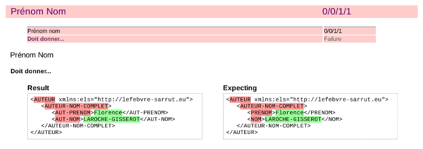

Spécifications Xspec
====================

Michel Casabianca

m.casabianca-ext@lefevbre-sarrut.eu

---
Comment fonctionne Xspec ?
--------------------------

Xspec est un framework de test unitaire pour XSLT. Il permet d'appliquer une transformation sur un fragment XML et de vérifier *automatiquement* que le résultat de cette transformation est celui attendu.

Par exemple, pour vérifier que le fragment :

```xml
<auteur>
  <aute>Florence LAROCHE-GISSEROT</aute>
</auteur>
```

Est transformé en :

```xml
<AUTEUR>
  <AUTEUR-NOM-COMPLET>
    <AUT-PRENOM>Florence</AUT-PRENOM>
    <AUT-NOM>LAROCHE-GISSEROT</AUT-NOM>
  </AUTEUR-NOM-COMPLET>
</AUTEUR>
```

On écrira le test suivant :

---
Exemple de test
---------------

```xml
<?xml version="1.0" encoding="UTF-8"?>

<x:description xmlns:x="http://www.jenitennison.com/xslt/xspec"
               stylesheet="../../main/xsl/main.xsl">

  <x:scenario label="Prénom nom">
    <x:context>
      <auteur>
        <aute>Florence LAROCHE-GISSEROT</aute>
      </auteur>
    </x:context>

    <x:expect label="Doit donner...">
      <AUTEUR>
        <AUTEUR-NOM-COMPLET>
          <AUT-PRENOM>Florence</AUT-PRENOM>
          <AUT-NOM>LAROCHE-GISSEROT</AUT-NOM>
        </AUTEUR-NOM-COMPLET>
      </AUTEUR>
    </x:expect>
  </x:scenario>

</x:description>
```

---
Résultat des tests
------------------

On pourra exécuter ce test dans Oxygen ou en ligne de commande. Xspec produit alors un rapport de test qui indique les tests ayant échoué avec la résultat obtenu comparé au résultat attendu :



Cet affichage de la différence entre l'attendu et le résultat est très pratique pour corriger les tests.

---
Éléments *context* et *expect*
------------------------------

A noter que l'on peut, pour l'élément *context* :

- Indiquer le contexte courant dans le fragment XML de l'entrée avec l'attribut *select*.
- Indiquer le mode dans lequel on doit appliquer la transformation avec l'attribut *mode*.
- Indiquer un fichier dans lequel se trouve le fragment XML de l'entrée avec l'attribut *href*.

Pour l'élément *expect* :

- Indiquer le résultat attendu dans l'attribut *select* (avec une expression Xpath).
- Indiquer une condition à tester dans un attribut *test* (avec une expression Xpath dont le résultat est un booléen).
- Indiquer le résultat attendu par le contenu d'un fichier avec l'attribut *href*.

On écrire plus d'un élément *expect*.

---
Astuces utiles
--------------

Il est aussi utile de savoir que l'on peut :

- Désactiver des tests en les entourants d'un élément *pending*.
- Ignorer tous les autres tests avec l'attribut *focus*.

Enfin, on peut inclure un fichier de tests dans un autre (avec l'élément *import*). On aura alors intérêt à lancer un unique fichier *main.xspec* qui importe tous les autres.

---
Pourquoi utiliser Xspec ?
-------------------------

Les raisons sont les mêmes que pour tout langage de programmation :

- Pour éviter les régressions.
- 
